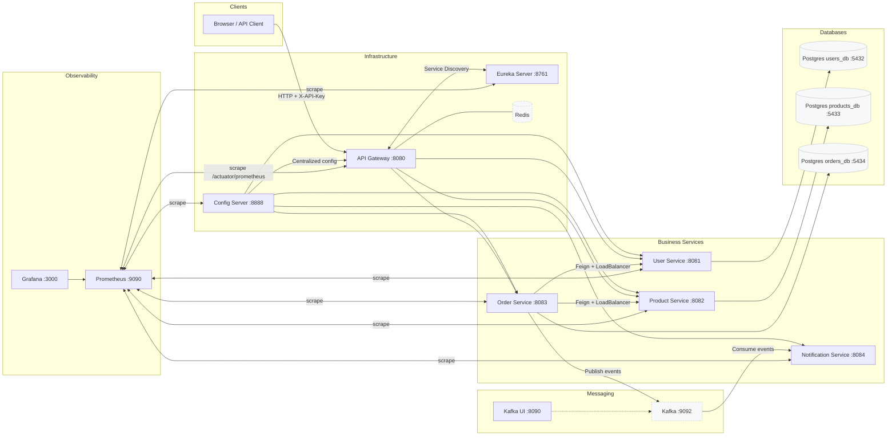

<div align="center">

# Mini‑Ecommerce Backend · Spring Boot Microservices

[](https://adoptium.net/)
[](https://spring.io/projects/spring-boot)
[](https://spring.io/projects/spring-cloud)
[](https://docs.docker.com/compose/)
[](https://prometheus.io/)

</div>

Production‑style e‑commerce backend built with decoupled microservices (Users, Products, Orders, Notifications). Features service discovery (Eureka), centralized configuration (Spring Cloud Config), an API Gateway (routing, retries, circuit breakers, Redis rate limiting), event-driven notifications (Kafka), per‑service PostgreSQL storage, and full observability via Micrometer/Prometheus/Grafana.

> TL;DR
>
> - Start everything (databases, microservices, Kafka, monitoring): `docker compose up -d --build`
> - API Gateway: http://localhost:8080 — requires header `X-API-Key: $env:API_KEY` (default: `example-api-key-12345`)
> - Services: Users (8081), Products (8082), Orders (8083), Notifications (8084) — exposed through the gateway under `/api/...`
> - Discovery (Eureka): http://localhost:8761
> - Config Server: http://localhost:8888/actuator/health
> - Kafka UI: http://localhost:8090
> - Prometheus: http://localhost:9090 — Grafana: http://localhost:3000 (admin/admin123)

---

## Table of Contents

- [Overview](#overview)
- [Architecture](#architecture)
- [Services](#services)
- [Tech Stack](#tech-stack)
- [Configuration & Environment](#configuration--environment)
- [Quick Start (Docker Compose)](#quick-start-docker-compose)
- [API Gateway: Routing & Security](#api-gateway-routing--security)
- [Resilience & Inter‑Service Communication](#resilience--inter-service-communication)
- [Observability](#observability)
- [Project Structure](#project-structure)
- [Try It](#try-it)
- [Troubleshooting](#troubleshooting)
- [Roadmap / Ideas](#roadmap--ideas)

---

## Overview

This repository implements a microservices e‑commerce backend:

- 4 decoupled business services (User, Product, Order, Notification) each with its dedicated PostgreSQL database or message consumer
- Event-driven notifications via Apache Kafka (email alerts, order confirmations)
- API Gateway (Spring Cloud Gateway) for routing, retries, fallbacks, circuit breaking, and Redis rate limiting
- Centralized configuration (Spring Cloud Config) + service discovery (Eureka)
- Out‑of‑the‑box observability via Actuator + Micrometer Prometheus + Prometheus + Grafana
- Fully containerized local environment (Docker Compose: networks, volumes, healthchecks, restart policies)

## Architecture



## Services

| Component            | Port | Role / Responsibility                                         |
| -------------------- | ---- | ------------------------------------------------------------- |
| API Gateway          | 8080 | Routing, CORS, CircuitBreaker, Retry, Rate limiting (Redis)   |
| Eureka Server        | 8761 | Service registry (discovery)                                  |
| Config Server        | 8888 | Centralized configuration (native profile)                    |
| User Service         | 8081 | User management + PostgreSQL `users_db`                       |
| Product Service      | 8082 | Product catalog + PostgreSQL `products_db`                    |
| Order Service        | 8083 | Order processing, Feign calls to Users/Products, Kafka events |
| Notification Service | 8084 | Email notifications via Kafka consumer                        |
| Kafka                | 9092 | Event streaming (order events, notifications)                 |
| Kafka UI             | 8090 | Web UI for Kafka cluster management                           |
| Prometheus           | 9090 | Scrapes Actuator Prometheus endpoints                         |
| Grafana              | 3000 | Dashboards & metrics visualization                            |

- Config Server (`config-server`): centralized configuration (native profile, mounts `config-repo`).
- Eureka Server (`eureka`): service registry (UI at `http://localhost:8761`).
- API Gateway (`api-gateway`): discovery-based dynamic routing, global CORS, circuit breakers, retries, Redis rate limiting, fallbacks.
- User Service (`user-service`): user management, PostgreSQL `users_db`.
- Product Service (`product-service`): product catalog, PostgreSQL `products_db`.
- Order Service (`order-service`): order orchestration, Feign calls to user/product services, publishes events to Kafka, PostgreSQL `orders_db`.
- Notification Service (`notification-service`): consumes Kafka events, sends email notifications via SMTP (Gmail).
- Kafka + Zookeeper: event streaming platform for asynchronous messaging.
- Kafka UI: web-based management UI for Kafka topics, consumers, and messages.
- Monitoring: Prometheus (scraping Actuator metrics) + Grafana (pre‑provisioned dashboards).

## Tech Stack

- Language / Build: Java 17, Maven
- Spring Boot 3 (Web, Validation, Data JPA, Actuator), HikariCP, Hibernate
- Spring Cloud 2024.x (Gateway, Config, Netflix Eureka, OpenFeign, LoadBalancer, Bootstrap)
- Messaging: Apache Kafka, Spring Kafka
- Resilience: Resilience4j (CircuitBreaker, Retry, RateLimiter) + AOP
- Data: PostgreSQL (database per service)
- Caching / rate limiting: Redis (Gateway limiter)
- Email: Spring Mail (SMTP)
- Observability: Actuator + Micrometer (Prometheus), Prometheus, Grafana
- Containers: Docker, Docker Compose

## Configuration & Environment

Compose file: `docker-compose.yml`.

Databases (containers):

- `user-db`: `users_db` (host port 5432)
- `product-db`: `products_db` (host port 5433)
- `order-db`: `orders_db` (host port 5434)

Expected variables (used by Compose & services) — see `.env.example` and copy to `.env`:

| Variable            | Description                                      | Example                                            |
| ------------------- | ------------------------------------------------ | -------------------------------------------------- |
| `POSTGRES_USER`     | PostgreSQL user (shared across DB containers)    | `postgres`                                         |
| `POSTGRES_PASSWORD` | PostgreSQL password                              | `postgres`                                         |
| `API_KEY`           | API key accepted by Gateway (`X-API-Key` header) | `example-api-key-12345`                            |
| `EMAIL_USERNAME`    | Gmail address for SMTP (Notification service)    | `your-email@gmail.com`                             |
| `EMAIL_PASSWORD`    | Gmail app password (not account password)        | `your-app-password`                                |
| `EMAIL_PORT`        | SMTP port                                        | `587`                                              |
| `EMAIL_ENABLED`     | Enable/disable email sending                     | `true`                                             |
| `GIT_URI`           | (Optional) Git repo URL for external config      | `https://github.com/your-org/your-config-repo.git` |
| `GIT_USERNAME`      | (Optional) Git basic auth user                   | `your-user`                                        |
| `GIT_PASSWORD`      | (Optional) Git token/password                    | `***`                                              |

Central config: `config-repo/`

- `application.yml` (shared): Actuator exposure, common Eureka settings, logging
- Per service: `eureka-server.yml`, `api-gateway.yml`, `user-service.yml`, `product-service.yml`, `order-service.yml`, `notification-service.yml`

## Quick Start (Docker Compose)

Prerequisites: Docker Desktop.

1. Create `.env` at the project root (copy the example including `API_KEY`):

```powershell
# Copier l’exemple d’environnement
Copy-Item .env.example .env -Force
```

2. Start all services (includes build):

```powershell
docker compose up -d --build
```

3. Verify UIs / endpoints:

- Gateway: http://localhost:8080/actuator/health
- Eureka: http://localhost:8761
- Kafka UI: http://localhost:8090
- Prometheus: http://localhost:9090
- Grafana: http://localhost:3000 (admin / admin123)

Shutdown & clean:

```powershell
docker compose down
```

## API Gateway: Routing & Security

Routing (from `config-repo/api-gateway.yml`):

- `/api/users/**` → `lb://user-service` (rewritten to `/users/**`)
- `/api/products/**` → `lb://product-service` (rewritten to `/products/**`)
- `/api/orders/**` → `lb://order-service` (rewritten to `/orders/**`)

Global filters:

- CircuitBreaker (fallback to `/fallback/...`)
- Retry (GET/POST on `BAD_GATEWAY`, `GATEWAY_TIMEOUT`)
- RequestRateLimiter (Redis) — e.g., `replenishRate: 10`, `burstCapacity: 20` on selected routes

Security (demo level — replace with JWT/OAuth in prod):

- `AuthenticationFilter` (Gateway) — requires header `X-API-Key: <value>`
- Public endpoints: prefixes `/gateway/info`, `/gateway/routes`, `/actuator`, `/fallback`

API Key: provided by `API_KEY` env var (default `example-api-key-12345` in `.env.example`).

PowerShell example:

```powershell
# GET des produits via le Gateway (avec API Key)
Invoke-RestMethod -Method GET `
  -Uri "http://localhost:8080/api/products" `
  -Headers @{ 'X-API-Key' = $env:API_KEY }
```

## Resilience & Inter‑Service Communication

- Order Service → User/Product via OpenFeign + LoadBalancer
- Resilience4j (see `config-repo/order-service.yml`): CircuitBreaker, Retry (exponential backoff), RateLimiter
- Gateway: CircuitBreaker + Retry + Redis Rate Limiter per route

## Observability

- Actuator endpoints at `/actuator/*`, Prometheus metrics at `/actuator/prometheus`
- Prometheus scrapes gateway, business services, config-server, eureka (see `monitoring/prometheus/prometheus.yml`)
- Grafana pre‑provisioned (datasources + dashboards under `monitoring/grafana/provisioning/`)

Access:

- Prometheus: http://localhost:9090
- Grafana: http://localhost:3000 (admin / admin123)

## Project Structure

```
mini-ecommerce-backend/
├─ docker-compose.yml
├─ config-repo/                  # Config centralisée (Spring Cloud Config - profil native)
│  ├─ application.yml            # config commune (Actuator, Eureka, logging)
│  ├─ api-gateway.yml
│  ├─ eureka-server.yml
│  ├─ user-service.yml
│  ├─ product-service.yml
│  ├─ order-service.yml
│  └─ notification-service.yml
├─ api-gateway/
├─ config-server/
├─ eureka/
├─ user-service/
├─ product-service/
├─ order-service/
├─ notification-service/
└─ monitoring/
   ├─ prometheus/prometheus.yml
   └─ grafana/provisioning/
```

## Try It

Swagger UI (test directly on each service):

- Users: http://localhost:8081/swagger-ui/index.html
- Products: http://localhost:8082/swagger-ui/index.html
- Orders: http://localhost:8083/swagger-ui/index.html
- Notifications: http://localhost:8084/swagger-ui/index.html

Kafka UI (monitor topics and messages):

- http://localhost:8090

Note: Swagger UI is served by each service; it isn't proxied through the Gateway routes.

Or use these basic sample calls (PowerShell). Ensure `API_KEY` is exported / in `.env` and stack is running.

```powershell
# List products
Invoke-RestMethod -Method GET -Uri "http://localhost:8080/api/products" -Headers @{ 'X-API-Key' = $env:API_KEY }

# Create a product (example body) - adjust fields to actual DTO
Invoke-RestMethod -Method POST -Uri "http://localhost:8080/api/products" -Headers @{ 'X-API-Key' = $env:API_KEY; 'Content-Type' = 'application/json' } -Body '{"name":"Sample","price":19.99}'

# Place an order (simplified payload)
Invoke-RestMethod -Method POST -Uri "http://localhost:8080/api/orders" -Headers @{ 'X-API-Key' = $env:API_KEY; 'Content-Type' = 'application/json' } -Body '{"userId":1,"items":[{"productId":2,"quantity":1}]}'
```

## Troubleshooting

- 401 Unauthorized → add header `X-API-Key: $env:API_KEY` (default `example-api-key-12345`).
- Services not discovered → check Eureka UI and `SPRING_CLOUD_CONFIG_URI`.
- DB connection failures → verify `.env` creds and Postgres ports (5432/5433/5434).
- Missing Prometheus metrics → wait for services to report `UP` at `/actuator/health`.
- Empty Grafana dashboards → verify Prometheus datasource and provisioning folders.
- Kafka not starting → ensure Zookeeper is healthy; check `docker logs kafka`.
- Email not sending → verify Gmail app password (not account password) and `EMAIL_ENABLED=true` in `.env`.

## Roadmap / Ideas

- Replace API key demo with JWT / OAuth2 (Keycloak or Auth0 integration)
- Add dedicated Auth service (user registration, roles, tokens)
- Implement distributed tracing (OpenTelemetry + Jaeger)
- Add integration tests & contract tests (Spring Cloud Contract)
- Expand Kafka usage: inventory updates, real-time stock alerts, order saga patterns
- Blue/green or canary deployment documentation (Kubernetes manifests)
- Security hardening: rate limiter policies, input validation tests, secrets management (Vault)

---

Happy coding! ✨
