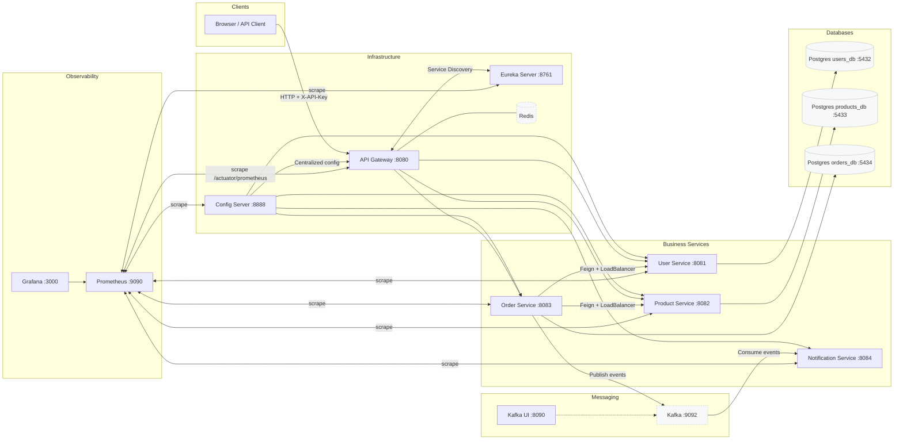

<div align="center">

# Mini‑Ecommerce Backend · Spring Boot Microservices

[](https://adoptium.net/)
[](https://spring.io/projects/spring-boot)
[](https://spring.io/projects/spring-cloud)
[](https://docs.docker.com/compose/)
[](https://prometheus.io/)

</div>

Production‑style e‑commerce backend built with decoupled microservices (Users, Products, Orders, Notifications). Features service discovery (Eureka), centralized configuration (Spring Cloud Config), an API Gateway (routing, retries, circuit breakers, Redis rate limiting), event-driven notifications (Apache Kafka + email), per‑service PostgreSQL storage, and full observability via Micrometer/Prometheus/Grafana.

> **TL;DR Quick Start**
>
> - **Prerequisites**: Docker Desktop, PowerShell (Windows) or Bash (Linux/Mac)
> - **Start**: `docker compose up -d --build` (builds and starts all services)
> - **Stop**: `docker compose down` (or `docker compose down -v` to remove volumes)
> - **API Gateway**: http://localhost:8080 — requires header `X-API-Key: example-api-key-12345`
> - **Microservices**: Users (8081), Products (8082), Orders (8083), Notifications (8084)
> - **Infrastructure**: Eureka (8761), Config Server (8888), Kafka UI (8090)
> - **Monitoring**: Prometheus (9090), Grafana (3000, admin/admin123)
> - **Email Setup**: Configure `EMAIL_USERNAME` and `EMAIL_PASSWORD` in `.env` (Gmail App Password required)

---

## Table of Contents

- [Overview](#overview)
- [Architecture](#architecture)
- [Services](#services)
- [Tech Stack](#tech-stack)
- [Configuration & Environment](#configuration--environment)
- [Quick Start (Docker Compose)](#quick-start-docker-compose)
- [API Gateway: Routing & Security](#api-gateway-routing--security)
- [Resilience & Inter‑Service Communication](#resilience--inter-service-communication)
- [Observability](#observability)
- [Project Structure](#project-structure)
- [Try It](#try-it)
- [Troubleshooting](#troubleshooting)
- [Roadmap / Ideas](#roadmap--ideas)

---

## Overview

This repository implements a microservices e‑commerce backend:

- **4 decoupled business services**: User, Product, Order, Notification — each with its dedicated PostgreSQL database or Kafka consumer
- **Event-driven architecture**: Apache Kafka for asynchronous messaging (order events, stock alerts, user notifications)
- **Email notifications**: Automated emails for order confirmations, shipping updates, and alerts via Gmail SMTP
- **API Gateway**: Spring Cloud Gateway with routing, retries, fallbacks, circuit breaking, and Redis-based rate limiting
- **Centralized configuration**: Spring Cloud Config Server (native file system or Git repository)
- **Service discovery**: Netflix Eureka for dynamic service registration and discovery
- **Production-ready observability**: Actuator + Micrometer Prometheus + Prometheus + Grafana
- **Fully containerized**: Docker Compose with networks, volumes, healthchecks, and restart policies

## Architecture



## Services

| Component            | Port | Role / Responsibility                                                     |
| -------------------- | ---- | ------------------------------------------------------------------------- |
| API Gateway          | 8080 | Routing, CORS, CircuitBreaker, Retry, Rate limiting (Redis), API Key auth |
| Eureka Server        | 8761 | Service registry and discovery                                            |
| Config Server        | 8888 | Centralized configuration (native file system or Git)                     |
| User Service         | 8081 | User management + PostgreSQL `users_db`                                   |
| Product Service      | 8082 | Product catalog + PostgreSQL `products_db`                                |
| Order Service        | 8083 | Order processing, Feign calls, Kafka event publisher                      |
| Notification Service | 8084 | Email notifications via Kafka consumer (Gmail SMTP)                       |
| Kafka                | 9092 | Event streaming (order-events, product-events, user-events)               |
| Zookeeper            | 2181 | Kafka cluster coordination                                                |
| Kafka UI             | 8090 | Web UI for Kafka cluster management and monitoring                        |
| Redis                | 6379 | Rate limiting for API Gateway                                             |
| Prometheus           | 9090 | Metrics collection and scraping from all services                         |
| Grafana              | 3000 | Dashboards & metrics visualization (admin/admin123)                       |

**Service Details:**

- **Config Server** (`config-server`): Centralized configuration management using native file system (`config-repo/` directory). Can be configured to use Git repository for production.
- **Eureka Server** (`eureka`): Service registry for dynamic service discovery. UI available at http://localhost:8761.
- **API Gateway** (`api-gateway`):
  - Discovery-based dynamic routing to all microservices
  - Global CORS configuration
  - Circuit breakers with fallback endpoints
  - Automatic retry on failures
  - Redis-based rate limiting per route
  - API Key authentication (`X-API-Key` header required)
- **User Service** (`user-service`):
  - User CRUD operations
  - PostgreSQL database `users_db` on port 5432
  - Swagger UI: http://localhost:8081/swagger-ui/index.html
- **Product Service** (`product-service`):
  - Product catalog management
  - PostgreSQL database `products_db` on port 5433
  - Publishes product events to Kafka
  - Swagger UI: http://localhost:8082/swagger-ui/index.html
- **Order Service** (`order-service`):
  - Order orchestration and processing
  - OpenFeign calls to User and Product services
  - Publishes order events to Kafka (`order-events` topic)
  - PostgreSQL database `orders_db` on port 5434
  - Resilience4j circuit breakers and retries
  - Swagger UI: http://localhost:8083/swagger-ui/index.html
- **Notification Service** (`notification-service`):
  - Consumes Kafka events from `order-events`, `product-events`, `user-events` topics
  - Sends automated email notifications via Gmail SMTP:
    - Order confirmations
    - Shipping updates
    - Stock alerts
  - Thymeleaf HTML email templates
  - Separate Kafka consumer factories for each event type
  - Swagger UI: http://localhost:8084/swagger-ui/index.html
- **Kafka + Zookeeper**:
  - Event streaming platform for asynchronous inter-service communication
  - Version: Confluent Platform 7.5.0
  - Auto-creates topics on first publish
  - Topics: `order-events`, `product-events`, `user-events`
- **Kafka UI**:
  - Web-based management interface
  - View topics, messages, consumer groups
  - Monitor cluster health
  - Access at http://localhost:8090
- **Monitoring Stack**:
  - Prometheus scrapes metrics from all services via `/actuator/prometheus`
  - Grafana pre-configured with Prometheus datasource
  - Custom dashboards in `monitoring/grafana/provisioning/dashboards/`

## Tech Stack

**Core Technologies:**

- **Language**: Java 17 (LTS)
- **Build Tool**: Apache Maven 3.9+
- **Framework**: Spring Boot 3.4.5
- **Cloud**: Spring Cloud 2024.0.0

**Spring Boot Modules:**

- Spring Web (REST APIs)
- Spring Data JPA (ORM, repositories)
- Spring Validation (Bean validation)
- Spring Actuator (health checks, metrics)
- Spring Mail (SMTP email)
- HikariCP (connection pooling)
- Hibernate (JPA implementation)

**Spring Cloud Modules:**

- Spring Cloud Gateway (API Gateway with filters)
- Spring Cloud Config (centralized configuration)
- Spring Cloud Netflix Eureka (service discovery)
- Spring Cloud OpenFeign (declarative HTTP client)
- Spring Cloud LoadBalancer (client-side load balancing)
- Spring Cloud Bootstrap (configuration bootstrap)

**Messaging & Events:**

- Apache Kafka 7.5.0 (event streaming)
- Spring Kafka (Kafka integration)
- Zookeeper 3.8+ (Kafka coordination)

**Resilience & Fault Tolerance:**

- Resilience4j (CircuitBreaker, Retry, RateLimiter, TimeLimiter)
- Spring AOP (aspect-oriented programming for resilience)

**Data Layer:**

- PostgreSQL 18 (Alpine) - 3 separate databases
- Flyway / Liquibase (optional migration tools)

**Caching & Rate Limiting:**

- Redis 8.2 (Alpine) - Gateway rate limiter

**Email:**

- Spring Mail with Gmail SMTP
- Thymeleaf (HTML email templates)

**Observability:**

- Micrometer (metrics facade)
- Micrometer Prometheus Registry
- Prometheus (time-series metrics database)
- Grafana (dashboards and visualization)

**API Documentation:**

- Springdoc OpenAPI 3 (Swagger UI)

**Containerization:**

- Docker 24+
- Docker Compose V2
- Multi-stage Dockerfiles (Maven build + JRE runtime)

## Configuration & Environment

**Docker Compose**: `docker-compose.yml` orchestrates all services with:

- Custom bridge network (`ecommerce-network`)
- Named volumes for persistent data
- Health checks for all critical services
- Automatic restart policies
- Environment variable injection from `.env`

**Database Containers:**

- `user-db`: PostgreSQL 18 - `users_db` (host port **5432**)
- `product-db`: PostgreSQL 18 - `products_db` (host port **5433**)
- `order-db`: PostgreSQL 18 - `orders_db` (host port **5434**)

**Environment Variables** — Create `.env` from `.env.example`:

| Variable            | Description                                         | Example / Default                                  |
| ------------------- | --------------------------------------------------- | -------------------------------------------------- |
| `POSTGRES_USER`     | PostgreSQL username (all databases)                 | `postgres`                                         |
| `POSTGRES_PASSWORD` | PostgreSQL password (all databases)                 | `postgres`                                         |
| `API_KEY`           | API Gateway authentication key (`X-API-Key` header) | `example-api-key-12345`                            |
| `EMAIL_USERNAME`    | Gmail address for SMTP (Notification service)       | `your-email@gmail.com`                             |
| `EMAIL_PASSWORD`    | **Gmail App Password** (not regular password!)      | `abcd efgh ijkl mnop` (16 chars)                   |
| `EMAIL_PORT`        | SMTP port (TLS)                                     | `587`                                              |
| `EMAIL_ENABLED`     | Enable/disable email notifications                  | `true` or `false`                                  |
| `GIT_URI`           | (Optional) Git repo for Config Server               | `https://github.com/user/config-repo.git`          |
| `GIT_USERNAME`      | (Optional) Git basic auth username                  | `github-username`                                  |
| `GIT_PASSWORD`      | (Optional) Git token or password                    | `ghp_xxxxxxxxxxxxx` (GitHub Personal Access Token) |

**Important Notes:**

- **Gmail App Password**: You MUST use a 16-character App Password, not your regular Gmail password!
  1. Enable 2-Step Verification: https://myaccount.google.com/security
  2. Generate App Password: https://myaccount.google.com/apppasswords
  3. Select "Mail" as the app type
  4. Copy the 16-character password to `EMAIL_PASSWORD`
- **Config Server**: By default uses native file system (`config-repo/`). For production, use Git backend.

**Centralized Configuration** (`config-repo/` directory):

- `application.yml`: Shared configuration (Actuator, Eureka client, logging)
- `eureka-server.yml`: Eureka server configuration
- `api-gateway.yml`: Gateway routes, filters, CORS, circuit breakers, rate limiting
- `user-service.yml`: User service datasource, JPA, resilience
- `product-service.yml`: Product service datasource, JPA, Kafka producer
- `order-service.yml`: Order service datasource, JPA, Feign, Kafka producer, resilience
- `notification-service.yml`: Kafka consumer, email/SMTP, Thymeleaf templates

## Quick Start (Docker Compose)

Prerequisites: Docker Desktop.

1. Create `.env` at the project root (copy the example including `API_KEY`):

```powershell
# Copier l’exemple d’environnement
Copy-Item .env.example .env -Force
```

2. Start all services (includes build):

```powershell
docker compose up -d --build
```

3. Verify UIs / endpoints:

- Gateway: http://localhost:8080/actuator/health
- Eureka: http://localhost:8761
- Kafka UI: http://localhost:8090
- Prometheus: http://localhost:9090
- Grafana: http://localhost:3000 (admin / admin123)

Shutdown & clean:

```powershell
docker compose down
```

## API Gateway: Routing & Security

Routing (from `config-repo/api-gateway.yml`):

- `/api/users/**` → `lb://user-service` (rewritten to `/users/**`)
- `/api/products/**` → `lb://product-service` (rewritten to `/products/**`)
- `/api/orders/**` → `lb://order-service` (rewritten to `/orders/**`)

Global filters:

- CircuitBreaker (fallback to `/fallback/...`)
- Retry (GET/POST on `BAD_GATEWAY`, `GATEWAY_TIMEOUT`)
- RequestRateLimiter (Redis) — e.g., `replenishRate: 10`, `burstCapacity: 20` on selected routes

Security (demo level — replace with JWT/OAuth in prod):

- `AuthenticationFilter` (Gateway) — requires header `X-API-Key: <value>`
- Public endpoints: prefixes `/gateway/info`, `/gateway/routes`, `/actuator`, `/fallback`

API Key: provided by `API_KEY` env var (default `example-api-key-12345` in `.env.example`).

PowerShell example:

```powershell
# GET des produits via le Gateway (avec API Key)
Invoke-RestMethod -Method GET `
  -Uri "http://localhost:8080/api/products" `
  -Headers @{ 'X-API-Key' = $env:API_KEY }
```

## Resilience & Inter‑Service Communication

- Order Service → User/Product via OpenFeign + LoadBalancer
- Resilience4j (see `config-repo/order-service.yml`): CircuitBreaker, Retry (exponential backoff), RateLimiter
- Gateway: CircuitBreaker + Retry + Redis Rate Limiter per route

## Observability

- Actuator endpoints at `/actuator/*`, Prometheus metrics at `/actuator/prometheus`
- Prometheus scrapes gateway, business services, config-server, eureka (see `monitoring/prometheus/prometheus.yml`)
- Grafana pre‑provisioned (datasources + dashboards under `monitoring/grafana/provisioning/`)

Access:

- Prometheus: http://localhost:9090
- Grafana: http://localhost:3000 (admin / admin123)

## Project Structure

```
mini-ecommerce-backend/
├─ docker-compose.yml
├─ config-repo/                  # Config centralisée (Spring Cloud Config - profil native)
│  ├─ application.yml            # config commune (Actuator, Eureka, logging)
│  ├─ api-gateway.yml
│  ├─ eureka-server.yml
│  ├─ user-service.yml
│  ├─ product-service.yml
│  ├─ order-service.yml
│  └─ notification-service.yml
├─ api-gateway/
├─ config-server/
├─ eureka/
├─ user-service/
├─ product-service/
├─ order-service/
├─ notification-service/
└─ monitoring/
   ├─ prometheus/prometheus.yml
   └─ grafana/provisioning/
```

## Try It

Swagger UI (test directly on each service):

- Users: http://localhost:8081/swagger-ui/index.html
- Products: http://localhost:8082/swagger-ui/index.html
- Orders: http://localhost:8083/swagger-ui/index.html
- Notifications: http://localhost:8084/swagger-ui/index.html

Kafka UI (monitor topics and messages):

- http://localhost:8090

Note: Swagger UI is served by each service; it isn't proxied through the Gateway routes.

Or use these basic sample calls (PowerShell). Ensure `API_KEY` is exported / in `.env` and stack is running.

```powershell
# List products
Invoke-RestMethod -Method GET -Uri "http://localhost:8080/api/products" -Headers @{ 'X-API-Key' = $env:API_KEY }

# Create a product (example body) - adjust fields to actual DTO
Invoke-RestMethod -Method POST -Uri "http://localhost:8080/api/products" -Headers @{ 'X-API-Key' = $env:API_KEY; 'Content-Type' = 'application/json' } -Body '{"name":"Sample","price":19.99}'

# Place an order (simplified payload)
Invoke-RestMethod -Method POST -Uri "http://localhost:8080/api/orders" -Headers @{ 'X-API-Key' = $env:API_KEY; 'Content-Type' = 'application/json' } -Body '{"userId":1,"items":[{"productId":2,"quantity":1}]}'
```

## Troubleshooting

- 401 Unauthorized → add header `X-API-Key: $env:API_KEY` (default `example-api-key-12345`).
- Services not discovered → check Eureka UI and `SPRING_CLOUD_CONFIG_URI`.
- DB connection failures → verify `.env` creds and Postgres ports (5432/5433/5434).
- Missing Prometheus metrics → wait for services to report `UP` at `/actuator/health`.
- Empty Grafana dashboards → verify Prometheus datasource and provisioning folders.
- Kafka not starting → ensure Zookeeper is healthy; check `docker logs kafka`.
- Email not sending → verify Gmail app password (not account password) and `EMAIL_ENABLED=true` in `.env`.

## Roadmap / Ideas

- Replace API key demo with JWT / OAuth2 (Keycloak or Auth0 integration)
- Add dedicated Auth service (user registration, roles, tokens)
- Implement distributed tracing (OpenTelemetry + Jaeger)
- Add integration tests & contract tests (Spring Cloud Contract)
- Expand Kafka usage: inventory updates, real-time stock alerts, order saga patterns
- Blue/green or canary deployment documentation (Kubernetes manifests)
- Security hardening: rate limiter policies, input validation tests, secrets management (Vault)

---

Happy coding! ✨
